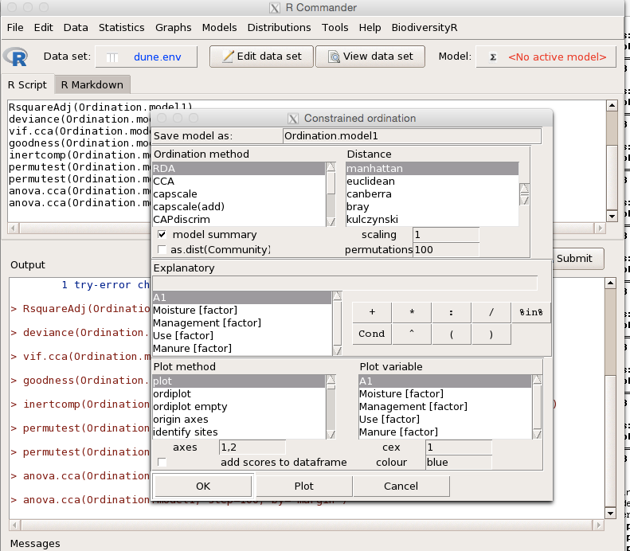
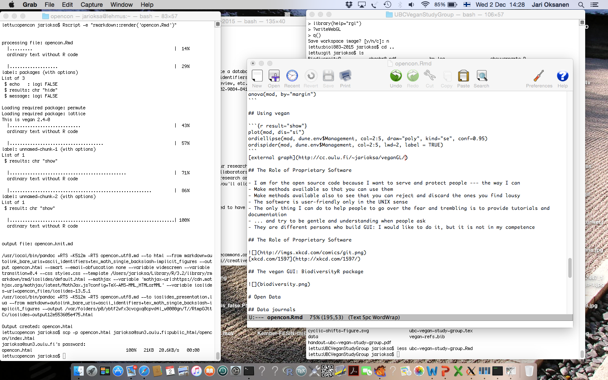

```{r packages, echo = FALSE, results = "hide", message = FALSE}
library("vegan")
library("vegan3d")
data(dune)
data(dune.env)
```


## This Talk

- [cc.oulu.fi/~jarioksa/opencon/](http://cc.oulu.fi/~jarioksa/kaamos/openkaamos.html)
- Source code available in [github](https://github.com/jarioksa/openkaamos16)
- Some slides by Gavin Simpson

# Background for the Talk
## Food and Gut of Science

- Data are the food of science: if it is available and plentiful, it can be used
- Code is the gut of science: you must pre-process the food
- Reproducible research: *you* should know what you have done, and others should be able to find out what you have done
- Impossible to reproduce or check results without access to data
- You should be able to see *through* the code

## Reproducibility

- Much of Open Science is about reproducibility and trust
- Reproducibility is the *essence* of science
- Amgen tried to replicate 53 landmark studies in basic cancer research ([Begley & Ellis, 2012](http:doi.org/10.1038/483531a))
- They could reproduce just *6*
- See *Nature* pieces from 8 October 2015
    - [Let's think about cognitive bias](http://doi.org/10.1038/526163a) (plus links)
    - [How scientists fool themselves --- and how they can stop](http://doi.org/10.1038/526182a)

## Open Code

- Even in less-technical subjects, computers pervade the scientific endeavour
- How to check that you didn't make a mistake
    - coding data?
    - data processing?
    - applying a statistical analysis?
- Can we truly trust results of research without access to their code?

## Sharing

- Sharing is the essence of science
- You share the results, or your interpretation of the results, and influence people
- You share the knowledge of tools needed to reach the result and the interpretation
- Greed -- for lack of a better word -- is bad. Greed is wrong, greed fails. Greed obscures, cuts through, and destroys the essence of the evolutionary spirit

## The Cryptic Title of This Talk
<div class="columns-2">


- Friedrich Nietsche's *Die fröhliche Wissenschaft* which translates apprroximately as "happy science" (but there are other translations)

</div>

# Ecology of Ecological Methods & Software

## The Levels of Analysis

1. Method: The idea of how things are done to achieve a goal in the analysis
2. Algorithm: The recipe of making the method real, or a map of reaching the goal
3. Code: implementation of the algorithm in a way that is understood both by humans and by computers
4. Software: Packaged code, sometimes impenetrable

- People often mix these: they should tell what methods they use, but they say what was the software
- Some people focus on open code, but the real value of code is to reveal the methods
- People should be concerned about the methods

## Bugs and Other Errors & Mistakes?

- Method can be poor, bad, even misleading and wrong, even fundamentally flawed
- Algorithm can be inefficient, slow, poor in performance, even wrong
- Code can contain bugs

    - Bugs are errors in the implementation of algorithm

- Software can package all these and add its own quirks

- **Your** choice of *method* can be mistaken, and your use of software can be wrong

## Open Methods

- Software is your contact point to the methods
- Software often packs various methods + arbitrary implementation choices into a pipeline
- Sometimes the implementation details ("options") can be more influential than the method
- You should know what you do, and therefore you should see through the software
- You should also be able to change the pipeline
- From scientists point of view, open source is just a way of making pipelines visible

## Open Source & Open Methods: Personal Experience

- **vegan**: a suite of analysis tools for a scientific niche: analysis of ecological community data of plants and animals
- The goal was to develop a simplified alternative to existing software --- and some of those were developed by my mates
- Some of the old software was only available for computer platforms that I did not have (*i.e.* Windows)
- Some was difficult to get because the developer had moved to another country and distributions were stale
- First steps were very short, but now grown to one of the most popular in its niche

[](http://depsy.org/package/r/vegan)
[](http://cran.rstudio.com/web/packages/vegan/index.html) [](http://cran.rstudio.com/web/packages/vegan/index.html)

## Pre-history of Scientific Software

- In olden times, software was distributed as source code
   - Often FORTRAN on punched cards (if you do not know what is a floppy disk, you better not ask what are punched cards), and compiled locally
- Source code was visible and could be inspected ... and often had to be inspected so that it could be compiled in the local system
- Also allowed inspection of the method, algorithm and implementation (which all are different things, although not all see this)
- It was customary to have local site versions of software
- Licence was often vague and could be very restrictive, but not enforced nor understood

## A Typical Licence

> C THIS INFORMATION IS PROPRIETARY AND IS THE                                     
> C PROPERTY OF BELL TELEPHONE LABORATORIES,                                       
> C INCORPORATED.  ITS REPRODUCTION OR DISCLOSURE                                  
> C TO OTHERS, EITHER ORALLY OR IN WRITING, IS                                     
> C PROHIBITED WITHOUT WRITTEN PRERMISSION OF                                      
> C BELL LABORATORIES. 

> C IT IS UNDERSTOOD THAT THESE MATERIALS WILL BE USED FOR                         
> C EDUCATIONAL AND INSTRUCTIONAL PURPOSES ONLY.          

&hellip; and this sits in an "open source" file that you *can* read and that you *must* compile to a closed executable

## The Birth of the Closed Scientific Software

- Closed-source statistical software (BMDP, SAS) was available for large centralized servers, but scientific niche was long dependent on software distributed as source files
- There was a huge number of platforms, and all needed different binaries --- and they were **expensive**
- Personal computers (IBM, Apple) created sufficiently large user space for distributing niche software only as binaries
- Personal computers often lacked tools to build source files --- in particular, FORTRAN
- Even if tools existed, users did not know how to use them
- Ability to read code and understand the innards of functions went out of fashion in 1990s

## Before Anybody Speaks Rubbish about Dinosaurs...


P.C. Serrano (1999) _Science_ __284__, 2137--2147.

## Open Source Resurrected

- Linux and the GNU project
- More effective personal computers that allow sufficiently fast non-compiled scripting languages (Python etc.)
- For scientific and statistical code, **R** language is the most important
- Based on **S**-language that was developed in the Bell Labs
- Inelegant design in Computer Science sense: but worse is better
- Designed to match the way a statistician thinks
- Statistical analysis and coding mixed together
- Base **R** allows adding functions and packages of functions which behave like native code
- ... All this may be intimidating to users

# The **vegan** Project

## The **vegan** Project: the Environment

- **vegan** provides basic tools for the analysis of ecological communities
- Ecological communities are made of a large number of species in a collection of sites
- Data are **multivariate** and need to be made comprehensible to users
- Several specialized tools and traditional analyses that are poorly represented in standard statistical toolboxes (SPSS, SAS)
- Niche market for commercial developers: even most of the paid software developed by scientists

## The **vegan** project: Goals

- Make methods available
- Make methods visible: you can inspect the code and see how the methods actually work --- some are shamefully naive
- Allow others to build upon **vegan** code or develop their own code based on **vegan** code
- Initially tried to take a moral high ground and have only preferred & sound methods --- but soon yielded to public demand
- **vegan** should be a good **R** citizen
    - Functions work like **R** functions should work
    - Be open: not bound to **vegan** but co-operate with other packages
    - Split functions to allow others to mix them in new ways, but provide wrappers for the ease of use

## The Power of **R**

```r
`RDA` <-
    function(Y, X, scale = FALSE)
{
    Y <- scale(as.matrix(Y), center = TRUE, scale = scale)
    X <- scale(as.matrix(X), center = TRUE, scale = FALSE)
    Q <- qr(X)
    RDA <- svd(qr.fitted(Q, Y))
    RDA$w <- Y %*% RDA$v %*% diag(1/RDA$d)
    RES <- svd(qr.resid(Q, Y))
    list(RDA = RDA, Resid = RES)
}
```

- This multivariate Redundancy Analysis required hundred of lines of FORTRAN code
- Built using basic **R** functions and works similarly as any native **R** function

## Germination and Growth

- Distributed in Comprehensive R Archive Network [CRAN](https://CRAN.R-project.org/package=vegan)
    - First released in 2001 when there were less than 200 packages --- now there are nearly 10,000
    - Gave a nice start for early adopters
    - Attracted other developers: Roeland Kindt, Bob O'Hara, Hank Stevens, Pierre Legendre, Gavin Simpson, Péter Sólymos, Peter Minchin among the first ones
- Developed now in [github](https://github.com/vegandevs/vegan)
     - More diverse and diffuse developer community
- Licensed GPL2 (but not GPL3): free licence that allows reuse of the code -- as long as you use a compatible licence and keep it open

## The Impact of Going **vegan**

- It has been [much cited](https://scholar.google.fi/citations?view_op=view_citation&hl=en&user=2WBRFVIAAAAJ&citation_for_view=2WBRFVIAAAAJ:u5HHmVD_uO8C) and obviously used to advance science
- It has atracted a healthy developer team for a scientic niche
- Moving to [github](https://github.com/vegandevs/vegan) has atracted more contributors: [issues](https://github.com/vegandevs/vegan/issues) and [pull request](https://github.com/vegandevs/vegan/pulls)
- Bug reports, wishes & code are **welcome**: just go to [github](https://github.com/vegandevs/vegan)
- A large number of other **R** packages utilize **vegan** functionality (see [CRAN](https://CRAN.R-project.org/package=vegan))
- One goal was to made methods public and open, and having these tools in **vegan** has helped in developing *methods* and *algorithms*

## Why it was Called vegan? {.flexbox .vcenter}


## Using vegan

```{r results="show"}
mod <- rda(dune ~ Management + Moisture + A1, dune.env)
anova(mod, by="margin")
```

## Using vegan

```{r result="show"}
plot(mod, dis="si")
ordiellipse(mod, dune.env$Management, col=2:5, draw="poly", kind="se", conf=0.95)
ordispider(mod, dune.env$Management, col=2:5, lwd=2, label = TRUE)
```
[external graph](http://cc.oulu.fi/~jarioksa/veganGL/)

## The Role of Proprietary Software

- I am for the open source code because I want to serve and protect people --- the way I can
- Make methods available so that you can use them
- Make methods available also to see that you can reject and discard the ones you find lousy
- The software is user-friendly only in the UNIX sense
- The only thing I can do to help people to go over the fear and trembling is to provide tutorials and documentation
- ... and try to be gentle and understanding when people ask
- They are different persons who build GUI: I would like to do it, but it is not in my competence

## The Role of Proprietary Software


[xkcd.com/1597](http://xkcd.com/1597/)

## The vegan GUI: BiodiversityR package



# Thanks

## Credits

- I have used some of the ideas and even slides of Gavin Simpson's [open science lectures (biol803)](https://github.com/gavinsimpson/biol803-2015)
- The presentation was built with [R Markdown](http://rmarkdown.rstudio.com)
- &copy; Jari Oksanen 2016 [CC-BY](http://creativecommons.org/licences/by/4.0/)

## How I Did This?



